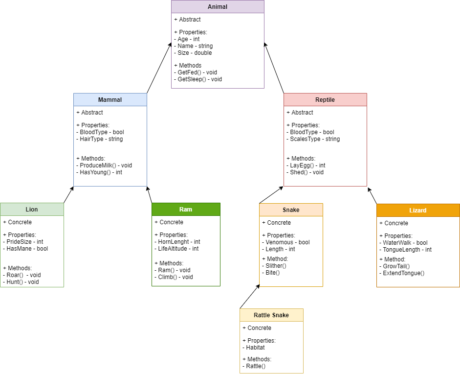

# OOP Application README
##### Lab06-OOP Part 1 of 2
##### Author: Robert Carter, Na'ama Bar-Ilan

### Description

##### This is a C# console application that will utilize UML to plan an application that will incorporate both Inheritance and Abstraction. There are several abstract and concrete objects that are tied together utilizing inheritance, with values being shared due to abstraction. 

#### Getting started

##### Clone this repository to your local machine.
###### $ git clone https://github.com/racarter1215/Lab06-OOP.git

### To run this application from VS:

##### Select File, then Open, then Project/Solution
##### Find the location of the cloned Repository
##### Select Robert-Lab2 folder
##### Select the next Robert-Lab3 folder
##### Select the Program.cs document

### Application WhiteBoard

#### Change Log
###### 1.3: TAs troubleshot technical problems with app execution - 8 July 2020
###### 1.2: README completed - 8 July 2020
###### 1.1: App first created - 8 July 2020

